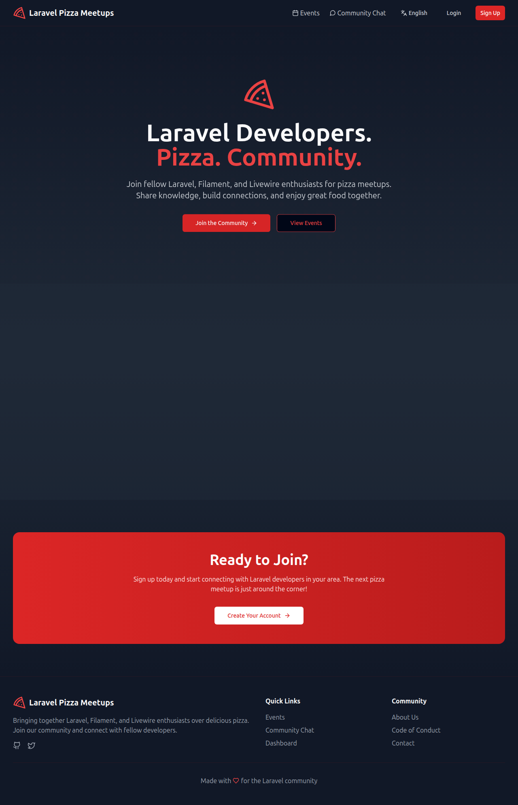
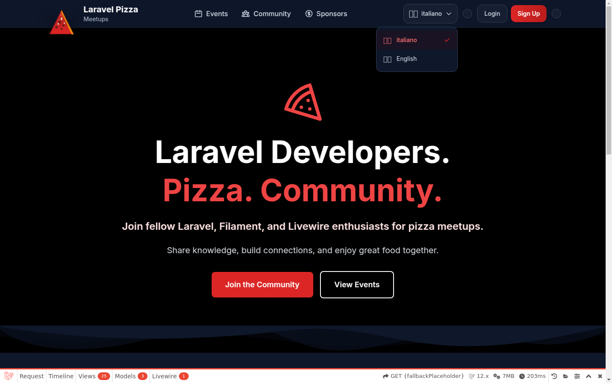

# Differenze grafica e miglioramenti – laravelpizza.com vs tema Meetup

Documentazione dettagliata delle **differenze visive** tra https://laravelpizza.com/ (riferimento) e la nostra implementazione, e **azioni di miglioramento** prioritarie.

Gli screenshot di confronto sono in [screenshots/grafica-confronto](screenshots/grafica-confronto/README.md); lì trovi anche come generarli (script Playwright, MCP o manuale).

---

## Screenshot di riferimento (evidenza visiva)

Confronto full-page per evidenziare le differenze a colpo d’occhio.

### Produzione (laravelpizza.com) – Homepage

### Nostra implementazione – Homepage

Screenshot della nostra home (tema light e dark) in sottocartella datata:

- **Light**: [local-home-light-1440.png](screenshots/2026-02-02/local-home-light-1440.png)
- **Dark**: [local-home-dark-1440.png](screenshots/2026-02-02/local-home-dark-1440.png)

Per nuovi screenshot full-page unificati (un solo file “nostra home”) usare `npm run screenshots` e salvare in [screenshots/grafica-confronto](screenshots/grafica-confronto/README.md) come `nostra-home.png`.

---

## 1. Header / Navigation

### Produzione (laravelpizza.com)

- **Logo**: un’unica riga “Laravel Pizza Meetups” con icona pizza a sinistra (stesso SVG riferimento).
- **Nav**: Events, Community Chat, dropdown lingua (English), Login (outline), Sign Up (rosso).
- **Stile**: sfondo scuro (slate/gray), bordo sottile, sticky.
- **Mobile**: menu hamburger.

### Nostra implementazione

- **Logo**: due righe “Laravel Pizza” + “Meetups” (componente `x-ui.logo` + testo separato). **Differenza**: layout logo non identico (due linee vs una).
- **Nav**: Events, Community (link potrebbe essere `/community` vs produzione `/chat`). Dropdown lingua e toggle light/dark aggiunti.
- **Stile**: supporto light/dark (slate-100/slate-900), bordo e shadow; coerente ma con più varianti.

### Differenze da evidenziare

| Aspetto | Produzione | Nostra | Evidenza |
|--------|------------|--------|----------|
| Testo logo | “Laravel Pizza Meetups” su una riga | “Laravel Pizza” + “Meetups” su due righe | Logo |
| Link chat | “Community Chat” → `/chat` | “Community” → `/community` (verificare slug) | Nav |
| Lingua | Solo dropdown English | Dropdown + toggle light/dark | Extra nostro |
| Sfondo nav | Scuro | Light/dark (slate-100 / slate-900) | Tema |

### Cose da migliorare

1. **Logo**: allineare a produzione con **una sola riga** “Laravel Pizza Meetups” (stesso SVG) se si vuole parity totale; oppure mantenere due righe e documentarlo come scelta.
2. **Slug Community Chat**: confermare che il link punti a `/chat` come in produzione (o aggiornare produzione se si usa `/community`).
3. **Screenshot**: salvare `laravelpizza-com-header.png` e `nostra-header.png` in `screenshots/grafica-confronto/` per confronto diretto.

---

## 2. Hero

### Produzione

- **Titolo**: “Laravel Developers.” (bianco) + “Pizza. Community.” (rosso), su due righe.
- **Sottotitolo/descrizione**: un paragrafo unico sotto il titolo.
- **CTA**: “Join the Community” (primario), “View Events” (secondario).
- **Sfondo**: grigio scuro (gray-900/gray-800), pattern SVG overlay.
- **Icona pizza**: sopra il titolo, grande.

### Nostra implementazione

- **Titolo**: stesso testo e split (“Laravel Developers.” + “Pizza. Community.”) in `hero/main.blade.php`; supporto light/dark (slate-900 / white in dark, red-500 per la seconda parte).
- **Sfondo**: in dark come produzione (gray-900/gray-800); in light slate-200/slate-100. Pattern SVG presente.
- **Icona hero**: SVG pizza “stroke” (contorno); in produzione potrebbe essere “fill”. **Differenza**: stile icona (stroke vs fill).
- **CTA**: stessi testi e stile (primario rosso, secondario outline).

### Differenze da evidenziare

| Aspetto | Produzione | Nostra | Evidenza |
|--------|------------|--------|----------|
| Icona pizza hero | Probabile fill/colore pieno | Stroke (contorno) | Hero icon |
| Sfondo hero | Solo dark | Dark + light mode | Tema |
| Pattern SVG | Sì | Sì | Allineato |

### Cose da migliorare

1. **Icona hero**: verificare su screenshot se produzione usa pizza “piena” (fill); in caso positivo sostituire l’SVG stroke con lo stesso SVG di produzione (es. path fill come in `resources/html/index.html`).
2. **Screenshot**: `laravelpizza-com-home.png` e `nostra-home.png` (full page) in `screenshots/grafica-confronto/` e ritaglio hero per confronto side-by-side (opzionale: `differenze-hero.png` con annotazioni).

---

## 3. Sezione “Why Join Our Community?”

### Produzione

- **Titolo**: “Why Join Our Community?”
- **Sottotitolo**: “More than just pizza - it’s about building lasting connections…”
- **4 card**: Regular Meetups, Growing Community, Multiple Locations, Real-time Chat.
- **Stile**: card scure con bordo, icona rossa, hover.

### Nostra implementazione

- **Contenuto**: stesso titolo, sottotitolo e 4 feature in `home.json` (blocco features grid).
- **Stile**: `features/grid.blade.php` con slate-800/50, border-slate-700, hover border-red-500, icone rosse. Allineato.

### Differenze da evidenziare

- Contenuto e struttura **allineati**. Eventuali micro-differenze: spaziatura, dimensione font, raggio bordo card (da verificare su screenshot).

### Cose da migliorare

1. Confrontare su screenshot padding e font-size con produzione; regolare Tailwind se serve.
2. Verificare che le icone (Heroicons) siano le stesse o equivalenti (calendario, users, map-pin, chat).

---

## 4. CTA finale “Ready to Join?”

### Produzione

- **Titolo**: “Ready to Join?”
- **Descrizione**: “Sign up today and start connecting with Laravel developers in your area. The next pizza meetup is just around the corner!”
- **Un solo bottone**: “Create Your Account” (bianco su rosso).

### Nostra implementazione

- **Contenuto**: in `home.json` (blocco cta banner) titolo, descrizione e CTA “Create Your Account” già allineati (niente secondo bottone).
- **Stile**: banner rosso (from-red-600 to-red-700), bottone bianco.

### Differenze da evidenziare

- Contenuto e numero di bottoni **allineati**. Eventuali differenze minori: padding del banner, dimensione testo (verificare su screenshot).

### Cose da migliorare

1. Su screenshot confrontare altezza e padding del box CTA con produzione.
2. Verificare che non compaiano blocchi “stats” o altri tra Features e CTA (produzione non ha stats; nostra home.json già senza stats).

---

## 5. Footer

### Produzione

- **Colonna 1**: logo, “Laravel Pizza Meetups”, descrizione, icone social (placeholder #).
- **Quick Links**: Events, Community Chat, Dashboard.
- **Community**: About Us, Code of Conduct, Contact (placeholder #).
- **Bottom**: “Made with [icon] for the Laravel community”.

### Nostra implementazione

- **Sezione footer**: `sections/footer.blade.php` o blocchi footer; struttura multi-colonna e link da verificare rispetto a produzione.
- **Link**: assicurarsi che Events, Community Chat, Dashboard puntino agli stessi path di produzione; About Us, Code of Conduct, Contact possono essere # fino a quando le pagine non esistono.

### Differenze da evidenziare

| Aspetto | Produzione | Nostra | Evidenza |
|--------|------------|--------|----------|
| Quick Links | Events, Community Chat, Dashboard | Verificare label e URL | Footer |
| Community | About Us, Code of Conduct, Contact | Verificare label e URL | Footer |
| Social | Icone con # | Verificare se presenti e link | Footer |

### Cose da migliorare

1. Allineare testi e URL del footer a produzione (Quick Links + Community).
2. Aggiungere “Made with [icon] for the Laravel community” se assente.
3. Screenshot footer produzione vs nostra per confronto (opzionale: `laravelpizza-com-footer.png`, `nostra-footer.png`).

---

## 6. Riepilogo priorità miglioramenti

| Priorità | Area | Azione |
|----------|------|--------|
| Alta | Logo header | Una riga “Laravel Pizza Meetups” come produzione, o documentare scelta due righe |
| Alta | Icona hero | Verificare SVG (fill vs stroke) e allineare a produzione |
| Media | Link nav | Community Chat → `/chat` (o allineare slug) |
| Media | Footer | Allineare Quick Links + Community + “Made with…” |
| Bassa | Spaziature/font | Confronto su screenshot e micro-aggiustamenti Tailwind |
| Bassa | Screenshot | Mantenere aggiornati `screenshots/grafica-confronto/` per regressioni |

---

## 7. Dove salvare gli screenshot

- **Cartella**: [screenshots/grafica-confronto](screenshots/grafica-confronto/).
- **Nomi**: `laravelpizza-com-home.png`, `nostra-home.png` (obbligatori); opzionali `*-header.png`, `*-footer.png`, `differenze-hero.png`.
- **Come generarli**:
  - **Script**: dalla cartella del tema `npm run screenshots` (usa Playwright; salva direttamente in questa cartella). Vedi [screenshots/grafica-confronto/README.md](screenshots/grafica-confronto/README.md).
  - **MCP**: vedi README sopra (copia dalla cartella temp alla cartella docs).
  - **Manuale**: estensione Full Page Screen Capture o DevTools; salva con i nomi indicati.

---

## Riferimenti

- [Grafica confronto laravelpizza](grafica-confronto-laravelpizza.md)
- [Homepage visual alignment analysis](homepage-visual-alignment-analysis.md)
- [Visual comparison analysis](visual-comparison-analysis.md)
- [MCP configuration](mcp-configuration.md) (workflow screenshot con MCP)
